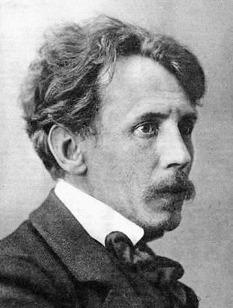

# Mikalojus Konstantinas Čiurlionis

## A tribute page dedicated to my favorite painter

This is my first project for the Free Code Camp [responsive web design certification.](https://www.freecodecamp.org/learn/responsive-web-design/responsive-web-design-projects/) Despite the fact that Free Code Camp insists on using Codepen as a place to host static websites, I much rather prefer GitHub pages.

***
 

Photo, public domain, https://commons.wikimedia.org/w/index.php?curid=5246728

M.K. Čiurlionis has always been in my heart ever since I first encountered his art and music when I was around 13. He impressed me with deep symbolism and philosophic meanig in his paintings, but perhaps what conquered me was not as much his art alone but his album dedications, diary entries, and letters. Almost fairy-tale like, naive and deep, symbolic and lyrical... There was a kind of simplicity that is found only in the basic truths of human existence, and he captured it. It takes a lot of sensitivity and wisdom to notice this, but also a big talent to express it. I think that I've never been the same again after I saw his art, and he was one of reasons of why I survived the challenges life threw at me.

To learn more about Čiurlionis, please take a look at the official website (not created by me, just a reference): http://ciurlionis.eu/en/

 

***
## Technical details of the project

+ flow : trunk
+ bundler : webpack with HMR
+ no framework, just SCSS + HTML + JS
+ usage of YouTube Player API
+ SPA with hash navigation

***

## References & credit

1) ### Sources of images:

    I found all the images either on Wikipedia, or on the  [official website](http://ciurlionis.eu/en/). The author of the images from that website is 
    
    > Rokas Zubovas  
    > ciurlionis.eu@gmail.com  
    > +370 (686) 96 633 

    The signature used in the navbar is an image owned by a wonderful designer

    > Rasa Špokauskaite  
    > https://rasaspokauskaite.wixsite.com/works/ 
    > [Linked In](https://www.linkedin.com/in/rasa-%C5%A1pokauskait%C4%97-3774a82a/) - [Portfolio](https://www.behance.net/rasiko/frame)
    
     [Typeface MKCiurlionis](https://www.behance.net/gallery/1103787/Typeface-MKCiurlionis) she created is very beautiful, unfortunately I can't use it as a ready font but I used the image as it happens to be exactly the color I needed (dark teal).

    All credit is attributed in the source files, too.

2) ### Codepen inspiration:

    Modern day programming is different from its predecessor, because we moved from inventing everything on our own to simply researching how to make something and customizing it/applying it to our goal. Most of the things that are beautiful have been already created by someone else. Since I really wanted to have my first website adhere to modern web design standards, I had to find inspiration somewhere. So in this section I am mentioning other people's codepens that I incorporated into my first site (and played with to make them somewhat different and fitting to my purpose). In this section I give well-deserved credit to those authors.

+ [Animated arrow button](https://codepen.io/nicoencarnacion/pen/XpaRQV) created by [Nico Encarnacion](https://codepen.io/nicoencarnacion) - I also modified the code to change its direction to its mirror image as I needed both directions;

+ [Book layout](https://codepen.io/erinesullivan/pen/gxdbzp) created by [Erin E. Sullivan](https://codepen.io/erinesullivan) - I found it to be the most realistic and minimalistic skeuomorph of a book out there that fit nicely for the concept of this tribute page;

***

**(c)@petajamaja**, 2020